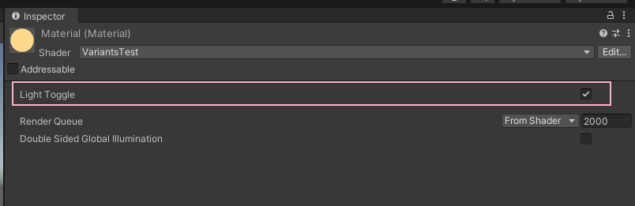

# Shader Variants

## 变体的由来

渲染效果 = 正常渲染代码 + 附加效果代码 （死亡溶解、外发光。。）

那么就需要对每个效果都写一个shader文件:

死亡溶解.shader = <font color=yellow>正常渲染代码 </font>+ 死亡溶解效果

外发光.shader =  <font color=yellow>正常渲染代码 </font> + 外发光效果

由此看出  <font color=yellow>正常渲染代码 </font> 是重复代码。

由此衍生出一个想法，能否只写一个Shader来承接需要的效果，美术同学仅仅通过开关就能切换看效果。(`Uber Shader`)

## 解决方案

1. 静态分支

   ```glsl
   #if
   #else
   #elif
   #endif
   ```

   

2. 动态分支

   ```glsl
   if
   else
   ```

   

3. 着色器变体

   ```glsl
   #pragma
   ```

   

### 如果选择三种方案？

1. 静态分支

   编译时生效，编译的时候已经决定了走哪个分支。如果需要不同开启，那就要存成不同的shader文件。

   没有走的分支在编译的时候就会被剪裁掉

   ```glsl
   #define I_AM_RED
   float4 frag(v2f i): SV_TARGET
   {
       #if defined(I_AM_RED)
       	return float4(1,0,0,1);
       #else
           return float4(0,0,0,1);
       #endif
   }
   ```

   

2. 动态分支

   运行时决定走哪个分支的代码。

   <font color=red>性能问题</font>  => 和着色器变体相比 是一种时间换空间的方式。

   ```glsl
   bool I_AM_RED;
   float4 frag(v2f i): SV_TARGET
   {
       if(I_AM_RED)
       {
           return float4(1,0,0,1);
       }
       else
       {
           return float4(0,0,0,1);
       }
   }
   ```

   

3. 着色器变体

   编译时生成多个静态分支的shader，运行时来决定用哪个。

   会增加运行时候的内存使用，是一种空间换时间的解决方案。

   可以理解成是静态分支的++++版本。

   ```glsl
    Shader "着色器变体"
   {
       Properties
       {
           [Toggle(I_AM_RED)]I_AM_RED("红色?", int ) = 0
       }
       SubShader
       {
           Pass
           {
               CGPROGRAM
               #pragma shader_feature I_AM_RED
   
               #pragma vertex vert
               #pragma fragment frag
   
               #include "UnityCG.cginc"
   
               struct v2f
               {
                   float4 vertex : SV_POSITION;
                   float2 uv: TEXCOORD1;
               };
   
               v2f vert(appdata_full v)
               {
                   v2f o;
                   o.vertex = UnityObjectToClipPos(v.vertex);
                   o.uv = v.texcoord;
                   return o;
               }
   
               float4 frag(v2f i):SV_Target
               {
                   #if I_AM_RED
                       return float4(1, 0, 0, 1);
                   #else
                       return float4(0, 1, 0, 1);
                   #endif
                   
               }
               ENDCG
           }
       }
   }
    
   ```
   
   
   
   ```glsl
   //版本1.shader
   float4 frag(v2f i): SV_TARGET
   {
     	return float4(1,0,0,1);
   }
   
   //版本2.shader
   float4 frag(v2f i): SV_TARGET
   {
       return float4(0,0,0,1);
   }
   ```

变体的集合成为 **Shader Variants**


## 使用变体

```glsl
Shader "VariantsTest"
{
    Properties
    {
        [Toggle]Light("Light Toggle", int ) = 0
    }
    SubShader
    {
        Pass
        {
            CGPROGRAM
            #pragma multi_compile LIGHT_OFF LIGHT_ON

            #pragma vertex vert
            #pragma fragment frag

            #include "UnityCG.cginc"

            struct v2f
            {
                float4 vertex : SV_POSITION;
                float2 uv: TEXCOORD1;
            };

            v2f vert(appdata_full v)
            {
                v2f o;
                o.vertex = UnityObjectToClipPos(v.vertex);
                o.uv = v.texcoord;
                return o;
            }

            float4 frag(v2f i):SV_Target
            {
                #ifdef LIGHT_ON
                    return float4(255.0/255,176.0/255,69.0/255,1);
                #else
                    return float4(0, 0, 0, 1);
                #endif
            }
            ENDCG
        }
    }
}
```



## shader变体的两种类型

| 类型             |                                                |
| ---------------- | ---------------------------------------------- |
| `multi_compile`  | 总是包含所有的shader变体组合，不管是不是启用了 |
| `shader_feature` | 材质设定中，不被启用的变体会被裁剪掉           |


### 变体的组合

```glsl
#pragma multi_compile A B
#pragma multi_compile C D  
```

最后生成的变体： AC AD BC BD

所以变体会造成代码几何倍数的增加。


## 控制Shader变体的生成

 项目中shader变体的生成方式主要有三种，其优缺点如下图所示：

| 生成方式                                                     | 优点                                             | 缺点                                                         |
| ------------------------------------------------------------ | ------------------------------------------------ | ------------------------------------------------------------ |
| shader与material打在一个包中                                 | 变体根据material中的keywords自动生成             | 1. 多个不同的material包中可能存在相同的shader变体，造成资源冗余. <br />2.若在程序运行时动态改变material的keyword，使用shader_feature定义的宏，其变体可能并没有被生成 |
| Shader单独打包，使用multi_compile定义全部宏                  | 全部变体都被生成，不会发生需要的变体未生成的情况 | 1.生成的变体数量庞大，严重浪费资源                           |
| Shader单独打包，shader_feature（需要使用ShaderVariantCollection生成变体）与multi_compile（还是会生成所有变体）结合使用 | 能够有效控制shader_feature变体数量               | 1.如何确定哪些变体需要生成 2.容易遗漏需要生成的变体，特别是需要动态替换的变体 |

> https://github.com/Nicholas10128/AAAResearch/blob/master/Experiences/Shader%E6%89%93%E5%8C%85%E6%A8%A1%E5%9D%97/Shader%E6%89%93%E5%8C%85%E6%A8%A1%E5%9D%97.md#shader%E5%8F%98%E4%BD%93%E6%94%B6%E9%9B%86%E4%B8%8E%E6%89%93%E5%8C%85


## 测试结果

1. Shader和material打在一个包中

   

2. Shader单独一个包

   


可以看出使用`multi_compile`的shader切换正常 (因为`multi_compile`都会生成变体)

而使用`shader_feature`的shader无法正常切换（缺少变体）

## ShaderVariantCollection解决

创建变体收集器

把shader_feature用到的变体加进去 


分别测试是否和shader打到一个包里，结果都测试后shader正常。这点和网上查到的资料不一致。


### 其他尝试

1. shader variant collection 不打进 ab包中： shader变体失败
2. shader variant collection 放进Resources中： shader变体成功。Resources也是个特殊的ab包，这个比较好理解。

比较成功与失败的两次shader.ab文件也可以发现。


确实大了0.1kb的内容，但是`AssetStudio`或者`uwa`的ab资源解析均无法解析出结果，所以内容不得而知，但是确实shader的glsl代码编译的内容多了。


## 总结

1. `multi_compile`无论如何都会生成所有的变体
2. `shader_feature`会通过默认值 和 `shader variant collection`配置文件的内容生成变体
3.  `shader variant collection` 测试后发现放哪里都可以，打进ab / Resources中即可
4. `shader`编写上取舍`multi_compile`和`shader_feature`。在明确知道组合的情况下，`shader_feature` + `collection`的方式产生的冗余变体最少，但是收集`collection`比较麻烦


> 参考资料：
>
> http://events.jianshu.io/p/48ad75f0b4b9
>
> https://zhuanlan.zhihu.com/p/68888831